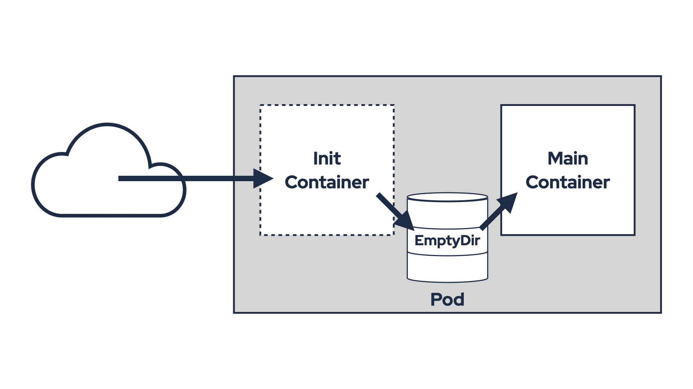
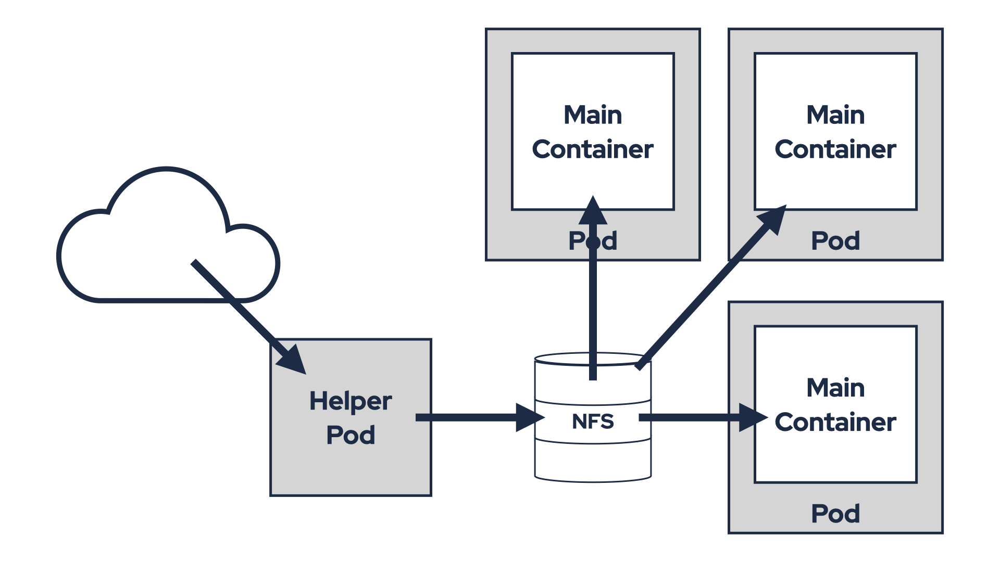
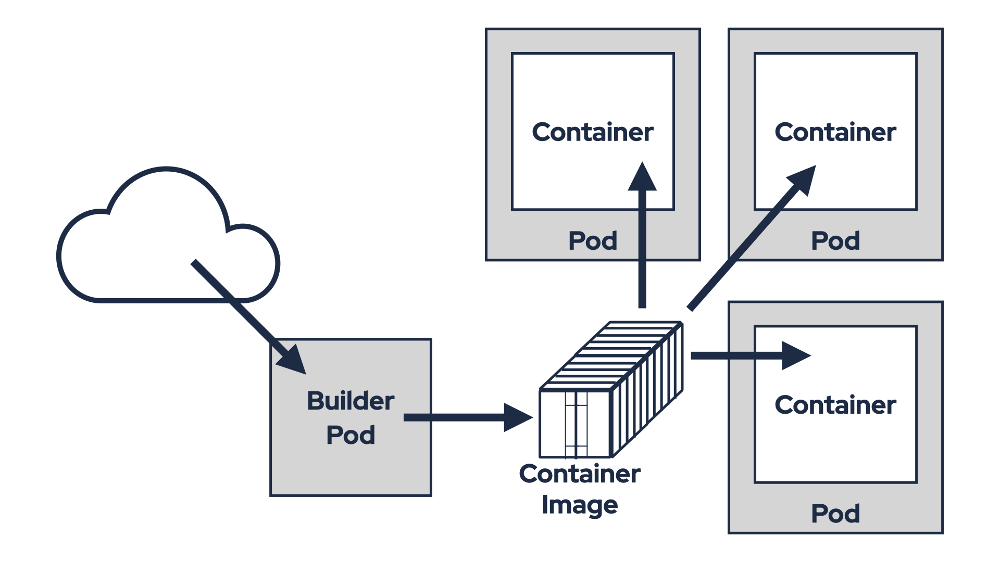
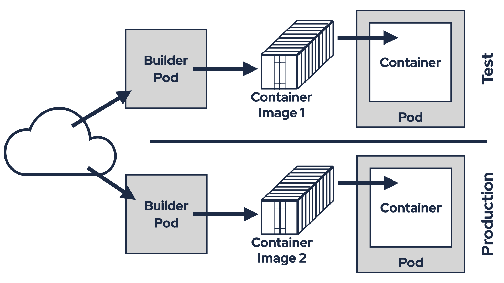

# Java, Pluggability, Kubernetes, and Image Volumes

One of the great advantages of Java and the applications built with it is how seamlessly it supports plugins and extensions.
For application developers, Java simplifies defining pluggable interfaces and discovering their implementations.
For users, Java provides an easy way to add plugins to their applications — just place the JAR(s) containing the plugin on the classpath.

Traditionally, this involved copying the JAR(s) to a directory with other JARs (e.g. a `libs` directory) or configuring the classpath to include a separate directory.
This approach eliminates the need to rebuild the entire application from source code whenever a new plugin is added.
You also do not need to use more complicated mechanisms such as WebAssembly (WASM) to allow loading the plugins.

Many applications leverage this feature of Java.
For example, [Strimzi](https://strimzi.io/) and [Apache Kafka](https://kafka.apache.org/) — two Java-based projects I work with almost every day — make extensive use of plugins.
Apache Kafka brokers provide numerous extension points for custom plugins, such as principal builders, tiered storage, authentication, authorization, quota managers, and more.
The Kafka Connect framework is entirely built around the concept of plugins.
It requires users to supply their own connector plugins, transformations, and (de)serializers.

Strimzi also allows users to bring their own plugins, such as [custom Pod security providers](https://strimzi.io/docs/operators/0.45.0/full/deploying.html#con-config-custom-security-providers-str) to customize the security contexts of Pods and containers.
In hindsight, we should have embraced plugins in Strimzi even more extensively — for instance, by implementing listener types as plugins.

## Plugins and containers

However, running Java applications on container-based infrastructures like Kubernetes complicates the simple process of adding plugins.
Container images are immutable, meaning files can only be added by extending and rebuilding the image.
While you can copy files into a running Pod using `kubectl cp`, this happens only after the Pod has started, which is usually too late.
And the copied file will be lost when the Pod is recreated.

This undermines one of Java's key strengths.
So, how can we address this challenge?
Here are some potential solutions.

### Copying Files _the Kubernetes Way_

A common approach involves using an init container and a shared volume to download and share plugin JARs.
An `emptyDir` volume is mounted in both the init container and the main application container.
The init container downloads the JARs, copies them into the shared volume, and exits.
The main container then includes the JARs in its classpath and uses them.
However, this requires modifying the Pod definition to add the volume and init container, which isn't always straightforward.
For example, Strimzi doesn't currently support custom init containers, so you'd need an admission controller to inject them.



Alternatively, you could prepare the plugins in a shared volume (e.g. NFS) and mount it directly into the Pod.
This avoids the need for an init container but requires infrastructure that supports shared volumes.
Shared volumes also introduce other challenges like managing plugin version updates.



Both options also suffer from another problem - they break the immutability of the containers.
It is easy to loose track of what software are you actually running in your environment.
Because while you know what software is baked into the container image you use, you do not know what exactly was copied to it at runtime from some init container.
Debugging issues can be also difficult since `emptyDir` volumes are temporary and their contents are deleted when the Pod terminates.
This means you have only limited supportability and it can have security implications as well.

So, are there any better options?

### Build a new container image

A more robust solution is to build a new container image with the required plugins.
For example, to add connectors to a Strimzi Kafka Connect container:

1. Create a Dockerfile that builds from the original container image and adds the plugins:
  ```Dockerfile
  FROM quay.io/strimzi/kafka:0.45.0-kafka-3.9.0
  USER root:root
  COPY ./my-plugins/ /opt/kafka/plugins/
  USER 1001
  ```
2. Build the container image with `docker build`.
3. Push it to a container registry with `docker push`.
4. Update the `KafkaConnect` custom resource to use the new image (`.spec.image`).

This approach maintains container immutability but introduces additional complexities, particularly in terms of security and maintenance.
Your new container image will consist of two components:
* The original `quay.io/strimzi/kafka:0.45.0-kafka-3.9.0` image, which includes the base operating system along with Strimzi and Apache Kafka JARs.
* And a new layer containing your plugin JARs.

This impacts handling of CVEs or upgrades.
Let’s examine how different CVE scenarios might be addressed:

1. **CVEs in your plugins**

   If a vulnerability is identified in your plugin JARs, you will need to update them, build a new version of your container image, and modify the Strimzi custom resources to roll out the updated image.
2. **CVEs in Strimzi or Kafka JARs**

   In this case, a new release of Kafka or Strimzi must first be made available.
   Once the updated release is ready:
   * Update your Dockerfile to reference the new base image (e.g. `quay.io/strimzi/kafka:0.45.1-kafka-3.9.0`).
   * Rebuild your container image.
   * Update the Strimzi custom resources to deploy the new version.
3. **CVEs in the base operating system**
   
   This scenario presents significant challenges.
   If the vulnerability is important, Strimzi will update its container images without changing the image tag.
   Only the image digest will be updated.
   For example:
   * Old digest: `quay.io/strimzi/kafka@sha256:4fe0dca258436fdf664a3c0df3f4ae21d9100dd613d048c501950d8b1a2cda34`
   * New digest: `quay.io/strimzi/kafka@sha256:e73e191d671cab3fe93dce6f1e151efcb9381bc60697472fef999ca3e208b784`

   You will need to monitor these changes closely and rebuild your container image accordingly.

Upgrading either Strimzi or Kafka also requires updating your Dockerfile and rebuilding your container image.
When upgrading Kafka, Strimzi will roll out a new Kafka cluster using container images with the updated version.
Similarly, upgrading Strimzi — even without changing the Kafka version — will roll out new container images.
So for upgrades you also need:
* Updating your Dockerfile to use the new image in the `FROM` declaration.
* Rebuilding your container image.
* Modifying custom resources or updating the Strimzi Cluster Operator configuration at the appropriate time.

While automation through CI pipelines can streamline parts of this process, it’s crucial to ensure that pipelines are triggered with precise timing and relevant changes.
This solution addresses immutability concerns but introduces its own set of challenges rather than offering a flawless resolution.

### Using Strimzi's Kafka Connect Build

Strimzi simplifies this process for Kafka Connect plugins with its [Kafka Connect Build](https://strimzi.io/docs/operators/0.45.0/full/deploying.html#creating-new-image-using-kafka-connect-build-str) feature.
Users specify plugins they want to use in the `KafkaConnect` custom resource as URLs or Maven coordinates.
Strimzi then generates a Dockerfile, builds the image, pushes it to a registry, and deploys it.



This approach combines the advantages of container immutability with the flexibility to add plugins automatically.
When changes occur — such as a version upgrade, a plugin update, or an updated base container image digest due to a CVE fix — Strimzi will automatically rebuild the image and roll it out to the Connect cluster.
This means you no longer need to manage the process of building and deploying container images yourself.
Strimzi takes care of it for you.

But even this solution has its limitations.
First, you need access to a container registry where the new image can be pushed.
On certain Kubernetes distributions, such as OpenShift, this is straightforward since it includes a built-in container registry. However, Kubernetes itself does not provide a built-in registry, meaning this feature is not guaranteed across all Kubernetes clusters.

You can deploy your own registry or use existing services like Docker Hub, GitHub, or Quay.io.
While these options are viable, they come with additional responsibilities, such as operating your own registry or managing accounts for external services.
Alternatively, you could use the [anonymous and ephemeral ttl.sh](https://ttl.sh/) registry, but this is not an enterprise-grade solution and may not meet professional standards.

Having a container registry is only the beginning of the problem. While this approach ensures immutability for container images, it does not guarantee software immutability across environments.

Consider this scenario.
On Friday afternoon, you fix a bug in one of your custom Kafka Connect connectors.
You upload the updated JAR file to an S3 bucket and modify the KafkaConnect custom resource in your test environment to use the new JAR.
Strimzi rebuilds the container image with the updated JAR and deploys it to your test environment.
Everything works well, but since it’s Friday afternoon, you decide to delay deploying it to production until Monday.

When Monday arrives, you update the KafkaConnect custom resource in your production environment in the same way.
However, Strimzi doesn’t reuse the container image it built on Friday and which you tested successfully.
Instead, it builds a brand-new container image and rolls it out to production.
This introduces potential risks.
For example, the base image might have been updated with a CVE fix that inadvertently breaks compatibility.



Although the container images are immutable within this mechanism, they may differ between environments due to these factors.
While most of the time everything works as expected, there’s always a chance of encountering issues because of these discrepancies.
To ensure reliability, what you truly need is to use the exact same container image that was tested on Friday in your production environment on Monday.
Unfortunately, Strimzi’s Kafka Connect Build feature cannot currently provide this level of consistency.

Building container images directly in a production environment also introduces significant security concerns.
A production environment with container image build capabilities is inherently risky.
If compromised, attackers could exploit it to create malicious images.
And push access to registries enable attackers to upload tampered images, potentially exfiltrating data or disrupting operations.
Breached production environment could allow attackers to inject plugins or transformations into Kafka Connect clusters, intercepting all messages.
For these reasons, many organizations prefer isolating build and runtime environments, as it helps to reduce attack surfaces and aligns with security best practices.

The Kafka Connect Build feature is excellent for development.
It automates the tasks and simplifies the process of iterating and testing things out.
However, when used in production, it addresses some challenges while introducing new ones.
So, is there truly a perfect solution?

### OCI Artifacts and Image Volumes

In the long term, OCI artifacts and Kubernetes Image Volumes may offer a better solution.
Image Volumes are a new feature introduced in Kubernetes 1.31.
It is currently in alpha and disabled by default.
You can learn more about it in the [Kubernetes documentation](https://kubernetes.io/docs/tasks/configure-pod-container/image-volumes/).
To use this feature, you need to explicitly enable the `ImageVolume` feature gate and ensure your Kubernetes cluster is running on a container runtime that supports it.
As of now, containerd does not support Image Volumes, but CRI-O does.

Image Volumes allow you to mount OCI objects as volumes.
These OCI objects (artifacts) are essentially container images, which can be for example:
* Fully runnable container images.
* Minimal "scratch-based" images containing archives or binaries, such as Java JAR files.

Most container registries and container tools today support OCI artifacts.
That makes it easy to build an artifact containing your plugin JARs and push it to a registry.
Below is an example of how I did this for my [Echo Sink Kafka Connect connector](https://github.com/scholzj/echo-sink):

1. Create a Dockerfile that starts from `scratch` and adds the connector JAR:
   ```Dockerfile
   FROM scratch
   COPY target/echo-sink-1.6.0.jar /
   ```
2. Build the container image:
   ```
   docker build -t ghcr.io/scholzj/echo-sink:v1.6.0 .
   ```
3. Push the container image to a container registry:
   ```
   docker push ghcr.io/scholzj/echo-sink:v1.6.0
   ```

Next, create a Pod that uses this artifact as an Image Volume.
For example:

```yaml
apiVersion: v1
kind: Pod
metadata:
  name: image-volume
spec:
  containers:
  - name: shell
    command: ["sleep", "infinity"]
    image: debian
    volumeMounts:
    - name: volume
      mountPath: /volume
  volumes:
  - name: volume
    image:
      reference: ghcr.io/scholzj/echo-sink:v1.6.0
      pullPolicy: IfNotPresent
```

Once the Pod is created, you can exec into it and verify that the plugin is present:

```
root@image-volume:/# ls -l /volume/
total 12
-rw-r--r-- 1 root root 8727 Apr  7 16:33 echo-sink-1.6.0.jar
```

So, can the Image Volumes be the solution?

### Using Image Volumes in Strimzi

Strimzi does not currently support Image Volumes.
However, let’s explore how such support could work using two examples:
* Adding a tiered storage plugin
* Adding Kafka Connect connector plugins

In the previous section, we saw how simple it is to create an OCI artifact containing one or more JAR files.
Now, let’s focus on how these artifacts **might** be utilized within Strimzi.

The simplest way to add support for Image Volumes in Strimzi would be by extending the existing [additional volumes feature](https://strimzi.io/docs/operators/latest/full/configuring.html#con-common-configuration-volumes-reference).
Strimzi already allows you to define additional volumes and volume mounts through the template section.
Currently, it supports mounting PVCs, Secrets, ConfigMaps, EmptyDir, and CSI volumes.
Adding support for Image Volumes would be a natural extension of this functionality.

With Image Volume support in place, you could easily:
* Add an OCI artifact containing the tiered storage plugin JARs as a new volume to the Kafka broker pod.
* Mount the volume within the Kafka container.
* Configure tiered storage directly in the Kafka configuration.

The resulting YAML configuration might look something like this:

```yaml
apiVersion: kafka.strimzi.io/v1beta2
kind: Kafka
metadata:
  # ...
spec:
  kafka:
    # ...
    tieredStorage:
      type: custom
      remoteStorageManager:
        className: io.aiven.kafka.tieredstorage.RemoteStorageManager
        classPath: /mnt/tiered-storage-plugin/*
        config:
          storage.backend.class: io.aiven.kafka.tieredstorage.storage.filesystem.FileSystemStorage
          storage.root: /mnt/tiered-storage/
          storage.overwrite.enabled: "true"
          chunk.size: "4194304" # 4 MiB
    template:
      pod:
        volumes:
          - name: tiered-storage-plugin
            image:
              reference: quay.io/scholzj/kafka-tiered-storage@sha256:6ab42af1377fce1b89af1648b7868cc21a6852790a8c1819451dc6f88df036dc
          - name: tiered-storage
            persistentVolumeClaim:
              claimName: tiered-storage-nfs
      kafkaContainer:
        volumeMounts:
          - name: tiered-storage
            mountPath: /mnt/tiered-storage/
          - name: tiered-storage-plugin
            mountPath: /mnt/tiered-storage-plugin/
  # ...
```

In this example, we:
* Add two volumes in `.spec.kafka.template`:
    * The NFS volume named `tiered-storage` that will be used as the tiered storage store
    * The Image volume named `tiered-storage-plugin` with our OCI container with the [tiered storage plugin from Aiven](https://github.com/Aiven-Open/tiered-storage-for-apache-kafka)
* Add two volume mounts in `.spec.kafka.template`:
    * `/mnt/tiered-storage/` for the NFS volume for storing the data
    * `/mnt/tiered-storage-plugin/` for the plugin JARs
* Configure the tiered storage in `.spec.kafka.tieredStorage`
    * Notice the `classPath` option that is set to `/mnt/tiered-storage-plugin/` to point to the mounted Image Volume

For Connect plugins, the API might need to work slightly differently since connector plugins must be mounted specifically to the plugin path and cannot be mounted to just any directory.
This would require a dedicated API.
The API could resemble the existing Kafka Connect Build feature but without the need for any build process.
It might look something like this:

```yaml
apiVersion: kafka.strimzi.io/v1beta2
kind: KafkaConnect
metadata:
  # ...
spec:
  # ...
  plugins:
    - name: echo-sink-connector
      artifacts:
        - type: image
          reference: ghcr.io/scholzj/echo-sink@sha256:7078b3ccbc0d6e76fefb832dd6e4bb6b704f83611428c9d5b060ab0b6c3e8712
```

This example introduces a new `.spec.plugins` section to define the connector plugins to be mounted.
Each plugin can include one or more artifacts.
In this case, I’m using a single artifact for my Echo Sink connector.
However, other connectors might require multiple artifacts, such as additional libraries or dependencies.
The Strimzi Cluster Operator will automatically handle adding the necessary volumes and mounting them to the plugin path.
Once deployed, the `.status` section of the KafkaConnect resource will indicate that the connector is available:

```yaml
  status:
    conditions:
      # ...
    connectorPlugins:
      - class: cz.scholz.kafka.connect.echosink.EchoSinkConnector
        type: sink
        version: 1.6.0
    # ...
```

The use of Image Volumes effectively separates two key concerns:
* The container image, provided by Strimzi, remains unmodified.
* Users are responsible only for creating and maintaining OCI artifacts containing their plugins.

As demonstrated earlier, creating OCI artifacts is straightforward.
In fact, it’s much simpler than publishing the plugin JARs to a Maven repository.
Since the process is essentially the same as building and using regular container images, most Kubernetes users are already familiar with it and likely have the necessary infrastructure in place.
This separation is crucial because it simplifies managing upgrades, addressing CVE fixes, and maintaining compatibility across different components.

But what does it mean for container immutability?
Technically, the software running in the container has been modified compared to the original container image.
However, it can be viewed as combining a set of immutable images:

* Base container: `quay.io/strimzi/kafka@sha256:e73e191d671cab3fe93dce6f1e151efcb9381bc60697472fef999ca3e208b784`
* Tiered storage plugin: `quay.io/scholzj/kafka-tiered-storage@sha256:6ab42af1377fce1b89af1648b7868cc21a6852790a8c1819451dc6f88df036dc`
* Connector plugin: `ghcr.io/scholzj/echo-sink@sha256:7078b3ccbc0d6e76fefb832dd6e4bb6b704f83611428c9d5b060ab0b6c3e8712`

Each of these images is immutable on its own.
When combined as a set, they provide transparency and reproducibility:
* It’s easy to understand exactly what software is running in your environment.
* You can reliably reproduce the exact same software setup across environments.

This approach represents a significant improvement over the previous options we discussed.

## Conclusion

While Kubernetes' Image Volumes feature is still maturing, it holds great potential for simplifying plugin management in containerized Java applications.
By combining the immutability of container images with the flexibility of OCI artifacts, it offers a promising path forward.

What are your thoughts?
Are there any challenges or drawbacks I might have overlooked?
